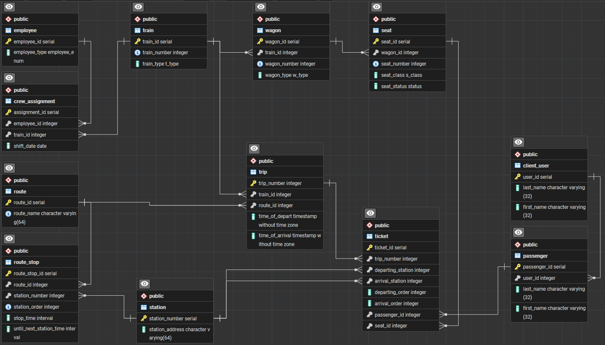

# Зайцев Антон ІО-46 Лабороторна Робота №5 з дисципліни Організація Баз Даних
## Нормалізація бази даних 

---

## Цілі

- Пошук надлишковості та аномалій: виявлення потенційної надлишковості даних (наприклад, повторювані значення) або аномалій оновлення (проблеми вставки/оновлення/видалення) у поточній схемі.
- Перелік функціональних залежностей: визначте та перелічіть функціональні залежності (ФЗ) для кожної проблемної таблиці.
- Перевірка нормальних форм: оцініть поточну нормальну форму кожної таблиці (1NF, 2NF, 3NF) на основі її функціональних залежностей (ФЗ) та структури ключа.
- Застосування нормалізації: перетворення таблиць у вищі нормальні форми (до 3НФ) для усунення часткових та транзитивних залежностей.

---

## Виконання лабороторної роботи

Опис [нормалізації](normalization.md)

Оновлена ER-Діаграма

[SQL скрипт](normalization-script.sql) нормалізації

#### Було приведено таблиці Ticket та Employee до форм 3NF та 1NF, відповідно.